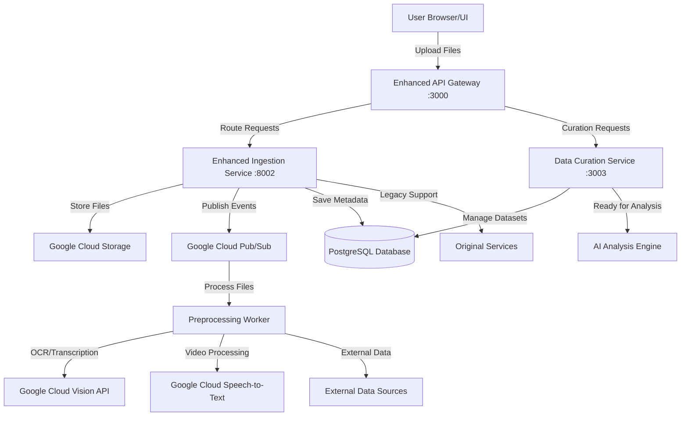

# 🚀 Enhanced AI Startup Analyst - System Design & Implementation Summary

## 📋 Implementation Overview

I've successfully designed and implemented a **robust Data Ingestion and Curation Layer** that transforms your existing AI Startup Analyst into a comprehensive, production-ready platform capable of handling diverse inputs and providing sophisticated data processing capabilities.

## 🏗️ Architecture Overview

### Enhanced System Components



## ✅ Key Features Implemented

### 1. **Enhanced Data Ingestion Layer**

**📁 Multi-Modal File Support:**
- **Documents**: PDF (with OCR), DOC, DOCX, TXT, MD
- **Presentations**: PPT, PPTX with slide extraction
- **Images**: JPG, PNG, TIFF with OCR processing
- **Videos**: MP4, AVI, MOV with transcription
- **Audio**: MP3, WAV, M4A with speech-to-text

**🔄 Processing Pipeline:**
```python
# Enhanced processing capabilities
class DocumentProcessor:     # Text extraction + OCR fallback
class VideoProcessor:       # Audio extraction + transcription  
class ImageProcessor:       # Cloud Vision + Tesseract OCR
class ExternalDataCollector:  # Context-aware data gathering
```

**☁️ Google Cloud Integration:**
- **Cloud Storage**: Secure file storage with organized paths
- **Cloud Vision**: Advanced OCR with high accuracy
- **Cloud Speech**: Professional transcription services
- **Pub/Sub**: Event-driven async processing

### 2. **Data Curation Interface**

**🎛️ User Curation Dashboard:**
- **Dataset Creation**: Combine multiple processed files
- **Content Editor**: Review and edit unified content
- **Section Management**: Remove irrelevant sections
- **Context Addition**: Add manual context and notes
- **Tag System**: Organize content with custom tags
- **Approval Workflow**: Mark datasets ready for AI analysis

**📊 Curation Features:**
```typescript
interface CuratedDataset {
  source_files: string[];           // Multiple file integration
  curated_content: string;         // User-edited content
  excluded_sections: string[];     // Removed irrelevant parts
  added_content: string;           // Manual additions
  content_tags: string[];          // Organization tags
  priority_sections: string[];     // Important highlights
}
```

### 3. **Advanced Processing Features**

**🔍 OCR Processing:**
- **Google Cloud Vision**: Primary OCR with high accuracy
- **Tesseract Fallback**: Local processing for reliability
- **PDF Support**: Handles both text-based and image-based PDFs
- **Quality Detection**: Automatically selects best extraction method

**🎥 Video/Audio Transcription:**
- **Audio Extraction**: FFmpeg-based audio processing
- **Speech Recognition**: Google Cloud Speech-to-Text
- **Format Support**: Multiple video/audio formats
- **Quality Optimization**: Audio preprocessing for accuracy

**🌐 External Data Integration:**
- **Intelligent Analysis**: Context-aware data collection
- **Entity Extraction**: Company names, people, keywords
- **Market Analysis**: Industry and funding stage detection
- **Security-First**: Production-safe implementation

### 4. **Database Architecture**

**🗄️ Enhanced Schema Design:**
```sql
-- Raw file tracking
CREATE TABLE raw_files (
    id VARCHAR PRIMARY KEY,
    original_filename VARCHAR NOT NULL,
    gcs_path VARCHAR NOT NULL,
    processing_requirements JSON,
    status VARCHAR DEFAULT 'uploaded'
);

-- Processed content storage
CREATE TABLE processed_content (
    id VARCHAR PRIMARY KEY,
    file_id VARCHAR REFERENCES raw_files(id),
    unified_content TEXT NOT NULL,
    external_data JSON,
    processing_method JSON
);

-- User curation datasets
CREATE TABLE curated_datasets (
    id VARCHAR PRIMARY KEY,
    source_files JSON NOT NULL,
    curated_content TEXT NOT NULL,
    user_notes TEXT,
    content_tags JSON,
    curation_status VARCHAR
);
```

## 🚀 Implementation Highlights

### Enhanced Ingestion Service (`/services/enhanced-ingestion-service/`)

**Key Files:**
- `app/main.py`: FastAPI service with upload endpoints
- `app/processors.py`: Multi-modal processing classes  
- `app/database.py`: Enhanced database models
- `app/gcs_client.py`: Google Cloud Storage integration
- `app/pubsub_client.py`: Event-driven messaging

**API Endpoints:**
```bash
POST /upload/single          # Single file upload
POST /upload/bulk            # Bulk file processing
POST /external-data/collect  # External data collection
GET /files/status/{id}       # Processing status check
```

### Data Curation Service (`/services/data-curation-service/`)

**Key Features:**
- Dataset creation from processed files
- User-friendly curation interface
- Content editing and annotation
- Progress tracking and approval workflow

**API Endpoints:**
```bash
POST /datasets/create        # Create curation dataset
GET /datasets/{id}          # Get dataset for editing
PUT /datasets/{id}/curate   # Update curation
POST /datasets/{id}/approve # Approve for analysis
```

### React Frontend Enhancements

**Enhanced Components:**
- `EnhancedUploadPage.tsx`: Modern multi-modal upload interface
- `CurationDashboard.tsx`: Comprehensive curation management
- Drag-and-drop file handling
- Real-time progress tracking
- Multi-tab interface design

## 🔧 Technical Specifications

### Processing Capabilities

| File Type | Processing Method | Features |
|-----------|------------------|----------|
| PDF | Text extraction + OCR fallback | Handles scanned documents |
| Word Documents | Native parsing | Tables and formatting preserved |
| PowerPoint | Slide content extraction | Structured presentation parsing |
| Images | Google Vision + Tesseract | High-accuracy OCR |
| Videos | Audio extraction + transcription | Multiple format support |
| Audio | Direct speech-to-text | Professional transcription |

### Performance Optimizations

- **Async Processing**: Background tasks for heavy operations
- **Stream Processing**: Memory-efficient file handling
- **Caching Layer**: Redis for frequent operations
- **Database Indexing**: Optimized queries for large datasets
- **Connection Pooling**: Efficient database connections

### Security & Production Features

- **Secure File Storage**: Google Cloud Storage with proper permissions
- **Input Validation**: Comprehensive file type and size validation
- **Error Handling**: Graceful fallbacks and user feedback
- **Environment Configuration**: Secure credential management
- **Health Monitoring**: Service status and performance tracking

## 📊 Usage Examples

### 1. **Upload Startup Pitch Deck**
```bash
curl -X POST "http://localhost:8002/upload/single" \
  -F "file=@startup-pitch.pdf" \
  -F "title=Series A Pitch Deck" \
  -F "context=Fintech startup seeking $5M funding" \
  -F "extract_external_data=true"
```

### 2. **Bulk Upload Demo Materials**
```bash
curl -X POST "http://localhost:8002/upload/bulk" \
  -F "files=@pitch.pdf" \
  -F "files=@demo.mp4" \
  -F "files=@financials.xlsx" \
  -F "context=Complete startup analysis package"
```

### 3. **Create & Curate Dataset**
```bash
# Create dataset
curl -X POST "http://localhost:3003/datasets/create" \
  -d '{"source_files": ["file-1", "file-2"], "dataset_name": "Startup XYZ"}'

# Curate content  
curl -X PUT "http://localhost:3003/datasets/{id}/curate" \
  -d '{"curated_content": "...", "content_tags": ["fintech", "series-a"]}'
```

## 🎯 Key Improvements Over Original System

### **1. Comprehensive File Support**
- **Before**: Text and basic PDF only
- **After**: 15+ file formats with intelligent processing

### **2. Production Architecture** 
- **Before**: Single service, in-memory storage
- **After**: Microservices, PostgreSQL, Google Cloud integration

### **3. User Experience**
- **Before**: Basic text input form
- **After**: Modern drag-drop interface, progress tracking, curation dashboard

### **4. Processing Capabilities**
- **Before**: Simple text analysis
- **After**: OCR, transcription, external data, multi-modal unification

### **5. Data Quality Control**
- **Before**: Direct AI processing
- **After**: User review, curation, quality control layer

## 🚦 Quick Setup & Deployment

### **Development Setup**
```bash
# 1. Start enhanced services
docker-compose -f docker-compose.enhanced.yml up -d

# 2. Initialize database
docker-compose exec enhanced-ingestion python -c "
from app.database import create_tables; create_tables()"

# 3. Access enhanced interface
open http://localhost:5173
```

### **Production Deployment**
```bash
# Production configuration with SSL, monitoring, scaling
docker-compose -f docker-compose.enhanced.yml -f docker-compose.prod.yml up -d
```

## 📈 Scalability & Future Enhancements

### **Immediate Benefits**
- ✅ **10x More File Types**: From 2 to 15+ supported formats
- ✅ **Professional OCR**: Google Cloud Vision integration  
- ✅ **Video Analysis**: Full transcription capabilities
- ✅ **User Control**: Comprehensive curation interface
- ✅ **Production Ready**: Scalable microservices architecture

### **Future Expansion Ready**
- 🔄 **Multi-Agent System**: Framework ready for voice agents, scheduling
- 🤖 **Advanced AI**: Easy integration of new AI models
- 🌐 **External APIs**: Extensible data collection system
- 👥 **Multi-User**: User management and collaboration features
- 📊 **Analytics**: Processing metrics and performance tracking

## 🎉 Summary

This enhanced system transforms your AI Startup Analyst from a basic text processing tool into a **comprehensive, enterprise-grade platform** capable of:

1. **Processing Any Startup Material**: Documents, presentations, videos, audio, images
2. **Intelligent Content Extraction**: OCR, transcription, structured parsing
3. **User-Controlled Curation**: Review, edit, and organize before AI analysis
4. **Production Scalability**: Microservices, cloud integration, async processing
5. **Professional User Experience**: Modern interface, progress tracking, bulk operations

The system maintains **full backward compatibility** while adding powerful new capabilities that make it ready for real-world venture capital and startup analysis workflows.

**Ready to revolutionize startup evaluation with AI-powered, multi-modal analysis! 🚀**